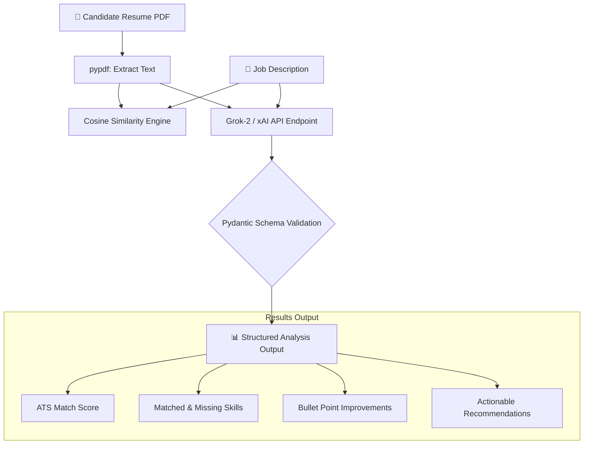

# 📄 AI Resume Analyzer (Powered by Grok & OpenAI SDK)

[](https://www.python.org/)
[](https://opensource.org/licenses/MIT)
[](https://x.ai/)
[](https://github.com/psf/black)

An intelligent, ATS-aligned **AI Resume Analyzer** built with Python and xAI's **Grok API**. This application extracts text from resume PDFs, computes semantic similarity against target job descriptions using vector embeddings, and leverages structured output schemas to provide actionable candidate feedback, missing skill analysis, and rewritten resume bullet points.

---

## 🏗️ Architecture & Pipeline Overview



---

## ✨ Key Features

- **Grok Engine**: Uses xAI's Grok model via OpenAI-compatible endpoints.
- **Semantic Vector Analysis**: Evaluates true contextual match using cosine similarity rather than superficial keyword counters.
- **Strict Structured Outputs**: Enforces validated Pydantic JSON schemas (`ResumeEvaluation`) to prevent hallucinated output structure.
- **Actionable Bullet Rewrites**: Provides candidate recommendations with metric-driven bullet point transformations.
- **Cloud-Ready**: Native configuration support for GitHub Actions (CI/CD) and GitHub Codespaces.

---

## 📁 Project Directory Structure

```text
ai-resume-analyzer/
├── .github/
│   └── workflows/
│       └── run_analyzer.yml    # Automated GitHub Actions runner
├── .devcontainer/
│   └── devcontainer.json       # Pre-configured Codespaces environment
├── sample_resume.pdf           # Sample input resume
├── requirements.txt            # Project dependencies
├── schema.py                   # Pydantic structured output models
├── embeddings.py               # PDF text extractor & cosine similarity logic
├── analyzer.py                 # Core Grok API client & prompt engine
├── main.py                     # CLI entry point
└── README.md                   # Documentation
```

---

## 🚀 Quick Start Guide

### Prerequisites

- **Python**: `3.10` or higher
- **xAI API Key**: Obtained from the [xAI Console](https://console.x.ai/)

### Local Setup

1. **Clone the Repository**
   ```bash
   git clone https://github.com/your-username/ai-resume-analyzer.git
   cd ai-resume-analyzer
   ```

2. **Create and Activate Virtual Environment**
   ```bash
   python3 -m venv venv
   source venv/bin/activate  # On Windows: venv\Scripts\activate
   ```

3. **Install Dependencies**
   ```bash
   pip install -r requirements.txt
   ```

4. **Environment Variables**
   Create a `.env` file in the root directory:
   ```env
   XAI_API_KEY=your_actual_xai_grok_api_key_here
   LLM_MODEL=grok-2
   ```

5. **Run Analysis**
   ```bash
   python main.py
   ```

---

## ☁️ Running on GitHub

### Option A: GitHub Codespaces
1. Add your API key as a secret in your repository: **Settings** $
ightarrow$ **Secrets and variables** $
ightarrow$ **Codespaces** $
ightarrow$ `XAI_API_KEY`.
2. Click **`< > Code`** $
ightarrow$ **Codespaces** $
ightarrow$ **Create codespace on main**.
3. In the web terminal, run:
   ```bash
   pip install -r requirements.txt
   python main.py
   ```

### Option B: GitHub Actions (Automated Runner)
1. Store your API key under **Settings** $
ightarrow$ **Secrets and variables** $
ightarrow$ **Actions** $
ightarrow$ `XAI_API_KEY`.
2. Push changes or manually launch the job from the **Actions** tab.

---

## 📄 License

Distributed under the MIT License. See `LICENSE` for details.
